## 👋 Hey there! I'm yjt0907

> 世界上只有一种真正的英雄主义，那就是认清生活的真相后依然热爱生活。
> —— 罗曼·罗兰

---

### 🏛️ SpeechLab-HDU

组织专注于语音与音频方向的算法研究，我主要负责 **语音增强 (Speech Enhancement)**。

---

### 🛠️ Tech Stack

---

### 📊 GitHub Stats

---

### 📫 Connect

